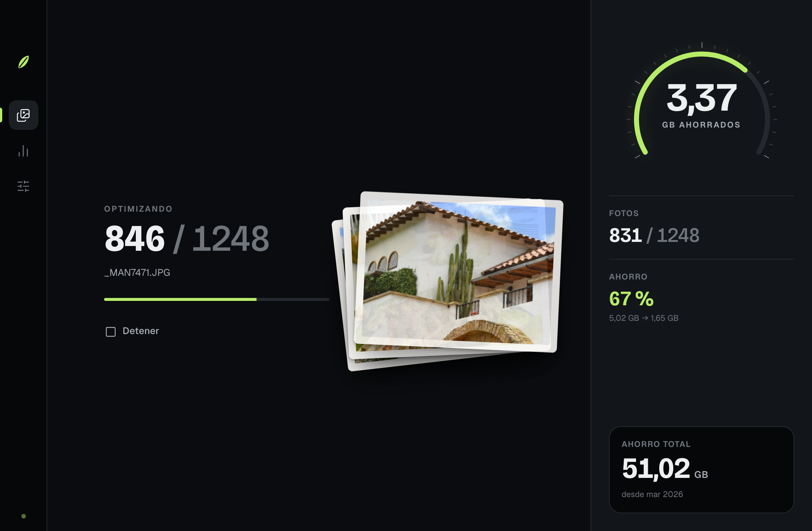
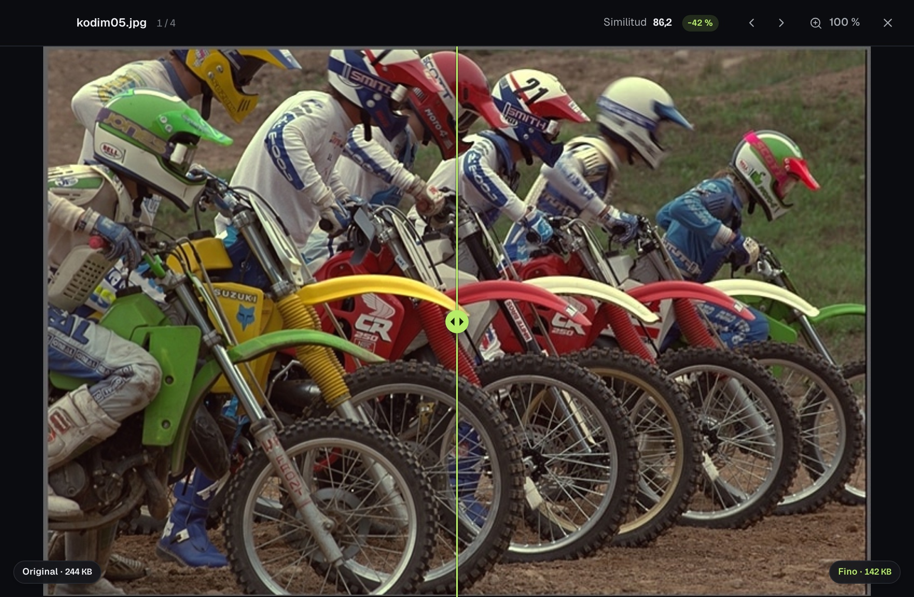
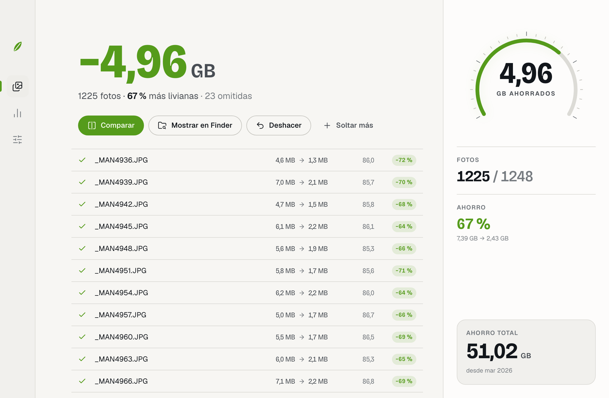
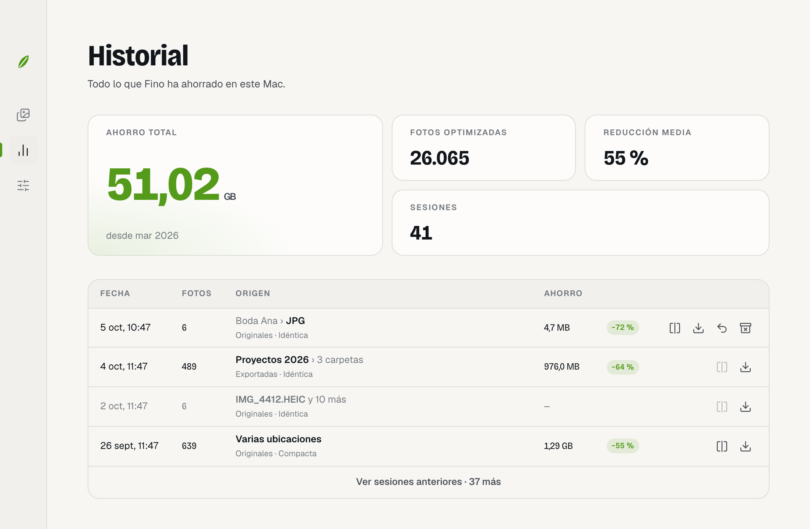
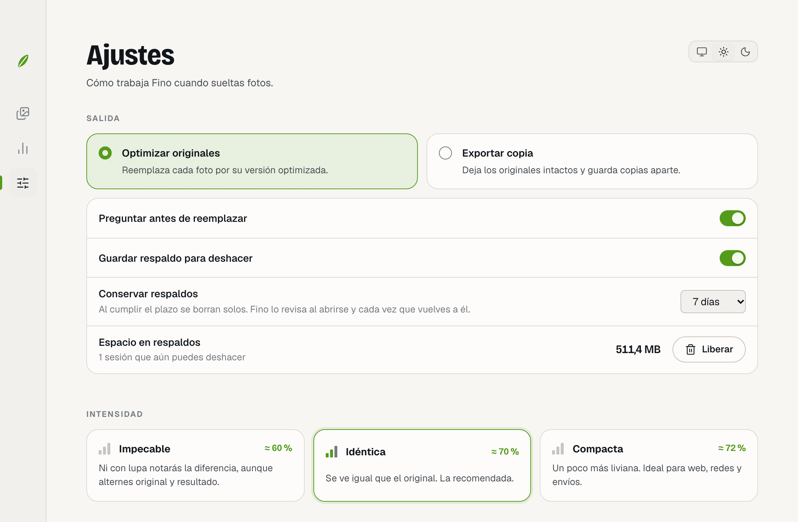

<sub>Alternativa a JPEGmini</sub>

# Fino

**Fotos más livianas que se ven exactamente igual.**

[English](README.en.md) · Español

[](https://github.com/AmunM9/fino/actions/workflows/ci.yml)

Fino es una app para macOS y Windows que recomprime JPEG con un criterio *perceptual*. Prueba versiones cada vez más pequeñas de cada foto, compara cada candidata con el original zona por zona y se queda con la más pequeña en la que no aparece ningún artefacto visible. Todo con piezas abiertas, en tu equipo y sin conexión.

```
89 fotos de cámara (24 MP)   511 MB → 156 MB   (−69,5 %)   ~0,25 s por foto
misma resolución · mismos metadatos · SSIMULACRA 2 ≈ 85
```



<table>
  <tr>
    <td></td>
    <td></td>
  </tr>
  <tr>
    <td></td>
    <td></td>
  </tr>
</table>

<sub>Capturas con datos de ejemplo: fotos reales de cámara y cifras simuladas con el ahorro medido (~67 %).</sub>

## Qué hace

| | |
|---|---|
| **Optimizar originales** | Reemplaza cada foto. Antes guarda un respaldo para que puedas **deshacer la sesión** (retención de 1, 7 o 30 días). |
| **Respaldos** | Viven en `~/Library/Application Support/app.fino.desktop/backups/` (Windows: `%APPDATA%\app.fino.desktop\backups\`). Se borran solos al vencer (Fino lo revisa al abrirse y al volver a la ventana). En Ajustes ves cuánto ocupan y puedes **liberarlos**; en Historial, descartar el de una sesión. Si los borras a mano, Fino lo detecta. |
| **HEIC → JPEG (opcional, macOS)** | Desactivado de fábrica: el HEIC ya es el formato más liviano y Fino lo deja como está. Si lo activas, cada HEIC pasa a JPEG en intensidad *Compacta* — unos 25 % más liviano que el HEIC en fotos de iPhone — con EXIF, XMP, perfil de color y orientación correctos; se quitan el HDR, la profundidad y los datos de retrato. Las Live Photos siguen emparejadas con su video. |
| **Ventana mini** | Un dial pequeño que flota sobre las demás apps: arrastras fotos o carpetas y ves pasar cada foto mientras se optimiza. |
| **Exportar copia** | Deja los originales intactos. Guarda las copias en una carpeta `Fino` junto a cada foto o en un destino fijo, y respeta la estructura de carpetas. |
| **Varios tamaños** | Hasta 4 tamaños por exportación (lado largo, ancho máx. o alto máx.). Respeta la orientación EXIF y nunca amplía. |
| **Intensidad** | *Impecable* (ni con lupa notarás la diferencia), *Idéntica* (recomendada: se ve igual que el original) y *Compacta* (un poco más liviana, para web y redes). |
| **Comparar** | Vista antes/después con divisor deslizable y **lupa al 100 %** que sigue al cursor. Solo se ofrece si el original y la versión optimizada siguen donde estaban. |
| **Historial** | Ahorro total, sesiones sin límite (base de datos SQLite local), deshacer y exportación del log a CSV con el motivo de cada archivo omitido. |
| **Tema claro y oscuro** | Sigue al sistema o se fija desde Ajustes; también la barra de título y los diálogos. |
| **Español e inglés** | Sigue el idioma del sistema (inglés si no es español). En macOS también se elige por app en Ajustes del Sistema → General → Idioma y región; en ambos sistemas, desde Ajustes de Fino. |
| **Privacidad** | Opción para quitar la ubicación GPS de EXIF y XMP; el resto de metadatos no se toca. |
| **Respeta tu archivo** | Conserva byte a byte EXIF, XMP, IPTC y perfiles ICC, además de fechas de creación y modificación, permisos y, en macOS, etiquetas de Finder. Escribe de forma atómica. |
| **Sin pérdida cuando conviene** | Si recomprimir no compensa (fotos ya comprimidas), reescribe solo la codificación: −3 a −7 % con píxeles **idénticos**. |
| **Nunca empeora** | Si no ahorra al menos un 3 %, deja el archivo como estaba. También salta las fotos que ya pasaron por Fino y los HDR con *gain map*. |
| **Abrir con Fino** | macOS: arrastra fotos o carpetas al icono del Dock o usa «Abrir con → Fino». Windows: «Abrir con → Fino» en el Explorador; si Fino ya está abierto, las fotos llegan a esa ventana. |
| **Apple Silicon, Intel y Windows** | Binario universal en macOS; en Windows 10/11 (x64) se instala por usuario en `%LOCALAPPDATA%\Programs\Fino`, sin permisos de administrador. |
| **CLI** | `fino` usa el mismo motor desde la terminal. |

## Instalar

Descarga el instalador de la [última versión](https://github.com/AmunM9/fino/releases/latest):

- **macOS**: abre el `.dmg` y arrastra Fino a Aplicaciones.
- **Windows**: ejecuta el instalador `Fino_x.y.z_x64-setup.exe`.

Los instaladores todavía no llevan firma de Apple ni certificado de Windows, así que la primera vez cada sistema avisa:
en macOS, abre Ajustes del Sistema → Privacidad y seguridad → «Abrir igualmente»; en Windows, en «Windows protegió su PC» pulsa «Más información» → «Ejecutar de todas formas».

## Cómo funciona el motor

```
JPEG ─► inspección ─► decodificación + coeficientes DCT ─► [resize Lanczos3]
     ─► búsqueda de calidad (pista del lote → salto al cruce previsto → interpolación)
           cada prueba: recuantización en el dominio DCT
                        tiles más difíciles a resolución completa → score global ½ res
           el mapa de error del score global elige qué tiles vigilar
     ─► ganadora escrita progresiva + Huffman óptimo (mismos píxeles)
     ─► ¿poca ganancia? → pasada sin pérdida (coeficientes DCT intactos)
     ─► metadatos originales + marcador «Fino/» ─► escritura atómica
```

- **Encoder**: recuantiza los coeficientes DCT del propio JPEG con la tabla de N. Robidoux, sin
  segunda conversión de color, DCT ni remuestreo de croma: cada prueba cuesta la mitad y la
  única pérdida añadida es la nueva cuantización. Salida progresiva con Huffman óptimo;
  conserva el submuestreo de croma original. Los HEIC y las salidas redimensionadas se
  codifican desde píxeles con libjpeg-turbo (vía mozjpeg).
- **Velocidad**: 89 fotos de 24 MP en ~22 s en un M1 Pro (unas 2 pruebas por foto).
- **Métrica**: [zensim](https://crates.io/crates/zensim), aproximación rápida de SSIMULACRA 2 en
  XYB: score global (banding, color) + **peor tile** a resolución completa (bloques, ringing),
  porque el ojo se va directo a la peor zona de la foto.
- **Umbrales** (calibrados contra SSIMULACRA 2 real con 89 fotos de cámara):

| Intensidad | Global (½ res) | Peor tile | SSIMULACRA 2 real |
|---|---|---|---|
| Impecable | ≥ 94,0 | ≥ 91,0 | ≈ 89 |
| Idéntica | ≥ 91,5 | ≥ 86,5 | ≈ 85,5 |
| Compacta | ≥ 89,0 | ≥ 82,5 | ≈ 82 |

## Estructura

```
crates/fino-core   motor: inspección, codec, métrica, búsqueda, metadatos, archivos
crates/fino-cli    binario `fino`
src-tauri          app de escritorio: sesiones, historial, respaldos, comandos IPC
src                interfaz (React + TypeScript)
docs               diseño y capturas
```

## Desarrollo

Requisitos: Rust estable, Node 18 o superior y `nasm` (SIMD de libjpeg en Intel/AMD). En macOS, Xcode Command Line Tools; en Windows, Visual Studio Build Tools (C++) y WebView2 (incluido en Windows 10/11).

```bash
npm install
```

```bash
npm run tauri dev
```

```bash
cargo test --workspace
```

```bash
npm run tauri build
```

En Windows, `npm run tauri build` genera el instalador en `target/release/bundle/nsis/`. Cada push a `main` y cada PR lo compilan también en GitHub Actions (artefacto `fino-windows-installer`), junto con los tests en macOS y Windows.

El código es uno solo para las dos plataformas: lo propio de cada sistema se elige al compilar (`#[cfg(target_os = …)]` en Rust, `src-tauri/tauri.windows.conf.json` para la ventana y el instalador, `data-platform` en la interfaz). En Windows no hay conversión HEIC (requiere el decodificador del sistema de macOS) ni etiquetas de Finder.

Binario universal de macOS (Apple Silicon + Intel; requiere el target `x86_64-apple-darwin`):

```bash
npm run build:universal
```

Para ver la interfaz en el navegador con datos de ejemplo, ejecuta `npm run dev` y abre `http://localhost:1420/?state=done` (parámetros: `state=idle|running|done`, `view=history|settings|compare`, `theme=light|dark`).

CLI:

```bash
cargo run --release -p fino-cli -- ~/Pictures/Viaje
```

```bash
cargo run --release -p fino-cli -- --in-place --long-edge 2048 --strip-location fotos/
```

Para calibrar los umbrales contra SSIMULACRA 2 real:

```bash
cargo run --release -p fino-core --example calibrate -- carpeta/con/jpegs
```

## Licencias de terceros

mozjpeg (IJG/BSD), zune-jpeg (MIT/Apache-2.0/Zlib), zensim (MIT/Apache-2.0), fast_image_resize (MIT/Apache-2.0) y Tauri (MIT/Apache-2.0). Fuentes: Bricolage Grotesque y Geist (SIL OFL 1.1). La foto del comparador es de la Kodak Lossless True Color Image Suite; las demás, del autor.

---

Fino es un producto de [The Shipping Labs](https://theshippinglabs.com/es) · © 2026 The Shipping Labs
